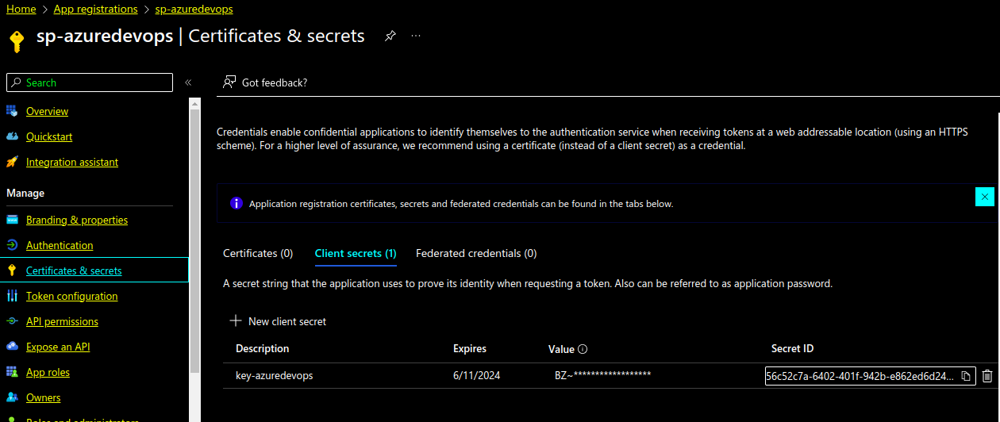
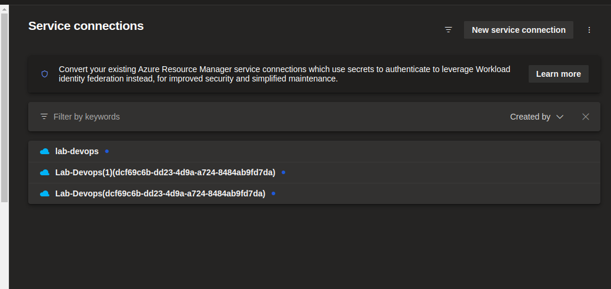

<p  width="100%">
     
</p>

# Entrega do Desafio 

## Azure

<p  width="100%">
     
</p>

<p  width="100%">
     
</p>

<p  width="100%">
     
</p>

<p  width="100%">
     
</p>

<p  width="100%">
     
</p>

<p  width="100%">
     
</p>

<p  width="100%">
     
</p>

## Azure Devops 

<p  width="100%">
     
</p>

<p  width="100%">
     
</p>

<p  width="100%">
     
</p>

<p  width="100%">
     
</p>


<p  width="100%">
     
</p>

<p  width="100%">
     
</p>

```
https://jeffersondossantos@dev.azure.com/jeffersondossantos/dio-devops/_git/dio-devops
```